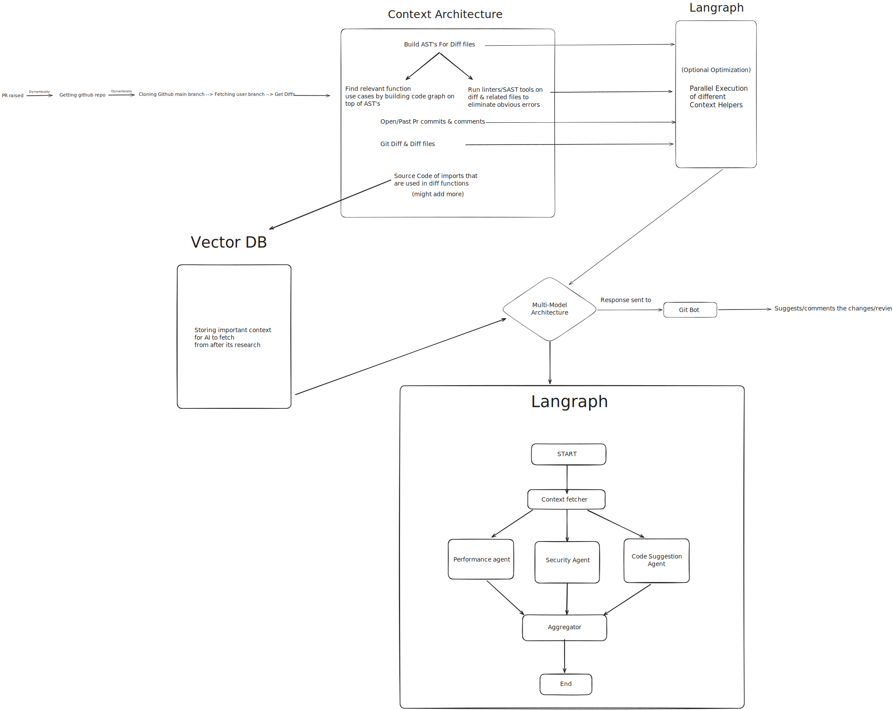

# PullRabbit - AI PR Reviewer

An AI-powered pull request reviewer that automatically analyzes your code changes and posts actionable review comments, analysis possible error earlier — similar to CodeRabbit or Greptile.

> **Status:** Early development. Core infrastructure and GitHub auth are in place; the review pipeline is being built.

---

## Overview

PullRabbit installs as a GitHub App on your repository. When a PR is opened, it clones the repo, computes the diff, runs deep contextual analysis, and posts inline review comments via a GitHub bot — covering correctness, security, and performance.

---

## Reviewer Features

| Feature | Description |
|---|---|
| **AST-based diff analysis** | Builds ASTs for changed files to understand code structure, not just line diffs |
| **Code graph traversal** | Traces call graphs to find relevant function use cases across the codebase |
| **Linter / SAST integration** | Runs linters and static analysis tools on diff & related files to surface obvious errors before LLM review |
| **Historical PR context** | Feeds open/past PR commits and comments as context to the model |
| **Import source resolution** | Fetches source code of imports used in changed functions for deeper context |
| **Multi-agent review** | Parallel specialist agents for code suggestions, security, and performance |
| **Multi-model architecture** | Routes tasks to the best model per agent |
| **Vector DB memory** | Stores accumulated context so agents can retrieve it during review |

---

## How It Works

```
PR Opened
   │
   ▼
Clone main branch → Fetch PR branch → Compute Diff
   │
   ▼
Context Fetcher  ──── parallel ────────────────────────────────┐
   ├── Build ASTs for diff files                               │
   ├── Build code graph → find relevant function use cases     │
   ├── Run linters / SAST on diff & related files              │
   ├── Fetch open/past PR commits & comments                   │
   └── Resolve import source for changed functions             │
                                                               │
                                              Vector DB (stores context)
   │
   ▼
LangGraph — Parallel Agent Execution
   ├── Code Suggestion Agent
   ├── Security Agent
   └── Performance Agent
   │
   ▼
Aggregator
   │
   ▼
GitHub Bot → Posts inline review comments on the PR
```

### Architecture Diagram



---

## Tech Stack

- **Backend:** Node.js, Express, TypeScript
- **Worker:** Separate worker service for async review jobs(BullMQ)
- **Queue:** Redis based queue system
- **AI pipeline:** LangGraph (multi-agent orchestration)
- **Auth:** GitHub OAuth
- **Infrastructure:** Docker Compose, Vercel
